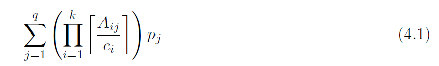
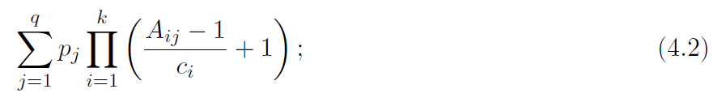
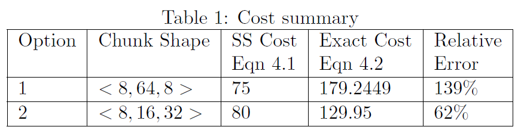
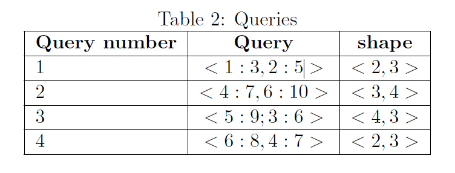
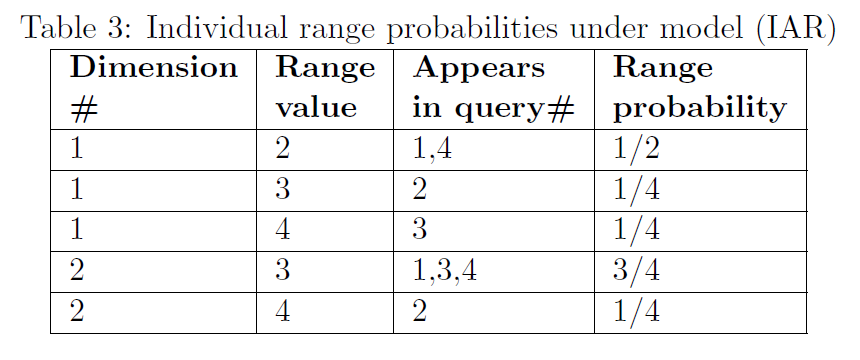
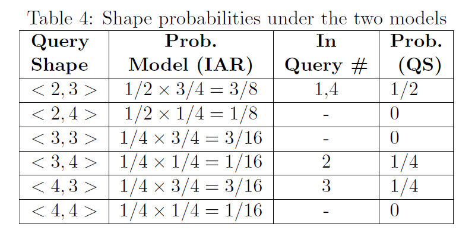
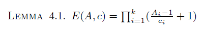
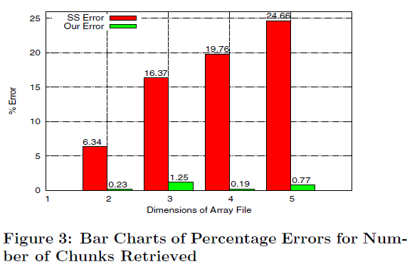
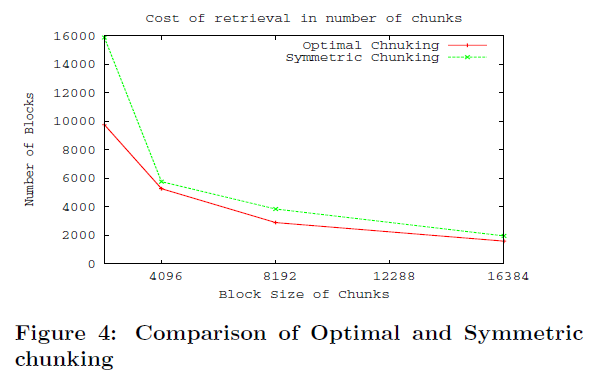

# Optimal Chunking of Large Multidimensional Arrays for Data Warehousing
- DOLAP '07: Proceedings of the ACM tenth international workshop on Data warehousing and OLAP
- ACM: Association for Computing Machinery

## Abstract
- Very large multidimensional arrays are **commonly used in** data intensive scientific computations as well as MOLAP
- **MOLAP**: on-line analytical processing applications
- The **storage organization of such arrays** on disks is done by partitioning the large global array into fixed size sub-arrays called chunks or tiles that form the units of data transfer between disk and memory.
- Typical queries involve the retrieval of sub-arrays in a manner that access all chunks that overlap the query results. An important **metric of the storage efficiency is the expected number of chunks retrieved over all such queries**.

Question:
“what shapes of array chunks give the minimum expected number of chunks
over a query workload?”

## Introduction
- Numerous applications in scientific domains such as Physics, Astronomy, Geology, Earth Sciences, Statistics, etc., map their problems space onto matrices and multi-dimensional arrays on which mathematical tools such as linear, non-linear equations
solvers and differential equation solvers can be applied.
- These arrays are required to be persistent on disks and subsequently accessed efficiently for scientific analysis.
- In general, both scientific and MOLAP datasets can be considered as a collection of multi-dimensional arrays that reside on secondary storage and queries on an array involve an orderly access of either the entire array or a hyper-rectangular sub-array.

### To store array elements on disk
#### A/ Naive strategy
One can naively utilize the mapping of multi-dimensional array indices onto linear storage.
  - example: C-order / F-order. Accessing the elements in a different order [...] gives very poor performance [16].
  - Such a layout is only worth considering if the array is generally dense, i.e., almost every array entry exists.
  - it is not extendible without storage reorganization.
  - considerations: 
    - array can be very large hence requiring lot of space and creating huge files
    - possible that arrays are sparse in which case we allocate much more space than necessary
    - in both scientific data storage and MOLAP storage, the data incrementally grows over time and as such the array storage mapping must be extendible. See Note (*)
    
Note (*):
We say an array is extendible if the array bounds are allowed to grow by admitting new array elements that
are appended to the storage space but without reorganizing previously allocated elements.

#### B/ Chunking
Persistent storage organization of multi-dimensional arrays is typically done by partitioning them into coarse-grained hyper-rectangular blocks called **chunks** or **tiles** which form the units of array transfers between disk and memory [15, 16, 5, 9].

- A chunk is characterized by two parameters: 
  - 1) the chunk size
  - 2) the chunk shape
  - The size is defined as the number of elements that can be contained in a chunk.
- **A query over the dataset for analysis retrieves** either the entire array or a sub-array in which case all the array chunks that overlap the query result are retrieved.
- Even though the elements contained in each chunk, are stored either in row-major order, or column major order, **the layout of the chunks on disk can be done using some other linear mapping** function such as the Morton sequence, Hilbert scan, or Peano scan order [8].

Benefits for multidim array storage: 
• array chunks with all zero entries are not stored and chunks with fewer entries below a
specified threshold can be compressed. This results in an improved storage utilization.
• Allocating chunks through an index scheme, e.g., B + -tree, allows for arbitrary array ex-
pansions without storage reorganization.

### Optimal chunk problem
- large chunk sizes may cause unnecessary data to be read
- small chunk sizes may require more disk accesses to retrieve all chunks to answer a query 
- the chunk shape influences the number of chunks retrieved in answering a query

An important metric of the storage efficiency is the expected number of chunks retrieved by queries under the access workload.

>>> Personal warning: if chunk is too big we only use 1 chunk for every query but we read more than necessary. Therefore the question should be stated as reducing chunk shape while maintaining the number of accessed chunks low.

#### Previous work 
The problem of optimal chunking was first introduced by
Sarawagi and Stonebraker [15], who gave an approximate solution to this problem. We show
that the optimal shape derivation given by Sarawagi and Stonebraker is only approximate and
under certain circumstances can deviate significantly from the true answer.

#### Contributions 
- The development of two accurate mathematical models of the chunking problem;
- show how the chunking parameters should be determined based on the probabilistic access patterns of sub-array queries.
- Derivation of exact solutions, one using steepest descent and another using geometrical programming method which lead to accurate retrieval costs and optimal chunk shape calculation.
- Experimental comparison of the estimation errors induced by the models using synthetic workloads on real life datasets.

## Related work
- In nearly all applications that use disk resident large scale multi-dimensional arrays, the physical organization of the array is by chunking.
- The other domain where array chunking has been predominantly used is in multidimensional on-line analytical processing algorithm (MOLAP) [19, 5, 9, 14, 12].
- Within each chunk,the array elements are laid out using a conventional row-major or column-major ordering.
- **The rationale for chunking large arrays**, whether dense or sparse, is justified in general when efficient I/O performance is desired in applications that access data with a high degree of locality.
- [19]: The array is split into chunks of size equal to the block size of the
disk storage system. Chunk compression is further used to improve storage utilization.
- [5]: bit-encoded scheme for the position index of the occurring array elements: bit-encoded sparse structure(BESS).
- In 19 and 5:
  -  the chunking schemes are not driven by the query access pattern.
  - given the fact that multi-dimensional databases for data warehousing have the propensity to grow, very little is discussed on how extendibility is managed in these schemes.
- The problem on handling extendibility in chunked arrays is the research focus of the work in [14, 12].

## Addressing Array Chunks: the BCRS
The Block Compressed Row storage BCRS [4], for sparse matrices forms the basis of a typical chunk addressing method
- The block addressing is done in two levels. The first level concerns locating the block that an element lies in and the second level concerns the location of the element within the block.
- Each block has a coordinate index <i, j>.
- The offset-values computed from a linear mapping function are organized into a vector of offset-indices.
  - A linear mapping function I_{ij} = g(<i, j>), maps the coordinate index <i, i> onto an integer I_{ij}
  - Inverse function <i, j>= g^{-1}(I_{ij}) takes an offset value and returns the coordinate index -> required for computing array
elements under some circumstances such as locating neighbors.
  - searching the offset index vector can be done with interpolation search OR the pairs of offset index and block pointers can be maintained as a balanced binary search tree. figure 2
- The BCRS method generalizes naturally to addressing of chunked multi-dimensional arrays.

For extremely large multi-dimensional arrays the first level chunk organization can be done with a B+−tree. This is the approach used in HDF5 [7], a popular multi-dimensional array file format used extensively in scientific computing.

> Note to self: offset index vector may be the indices of blocks to be retrieved

## Access Models of Arrays
We wish to store M on disk subject to the constraint that each disk block can hold at most C elements of M. This is done by partitioning M into equal shape rectangular chunks such that each chunk fits on a disk block. 

Queries: Figure 3.
- query q specifies a lower bound li and an upper bound ui on each of the k dimensions.
- The cost of answering this query is directly related to the number of chunks (disk blocks) that overlap the sub-array defined by the  query.

In [15], it was shown that knowledge of the predicted query access patterns can be efficiently used to select chunk dimensions that result in a **significant reduction in the cost of answering queries**.
- Prediction of query access patterns is usually based on query statistics that are collected using query history logs, sampling, or other statistical methods.

### A Motivating Example
The following small example shows that the inaccuracy of the cost expression in [15] can lead to inaccurate estimation of the access costs, but even more importantly to suboptimal choices of chunk shapes.

- the workload is represented as a collection of **q query shapes**, each occuring with probability pi (in this work and in 15).
- average query cost according to 15:

- actual query cost according to this study:

Example: 
- 3d dataset 
- query shape <40,60,120>
- block size constraint of 212=4096.
- 2 chunk shapes tested
- resulting table of costs:

- according to 15 we should choose chunk shape 1 but we can see from this study that it is a big error

### Two models commonly used for query access pattern prediction
In both model:
- each query is associated with a shape <A1,A2, . . . ,Ak>.
- the actual location of a query shape relative to the array is assumed to be uniformly distributed.

#### Independent Attribute Range (IAR)
- A probabilistic distribution of the possible range values is calculated separately for each of the k dimensions.
- It is therefore assumed that query range in each dimension is independent from each other [1]
- This assumption => the estimated probability of a query shape is calculated as a product of the estimated probabilities of its components

#### Query Shape (QS)
- From [15] (Sarawagi and Stonebraker)
- the query access pattern is estimated in terms of probability distribution of complete query shapes rather than distributions of ranges of individual dimensions.

The QS model, groups the queries into a collection of classes L1,L2,L3, . . . ,Lq such that the class Li contains all queries of shape <Ai1,Ai2, . . .Aik>. Each class Li is associated with a probability Pi.

#### Example in 2D

Access pattern estimation is based on a sample of 4 queries given in Table 2:

Range distribution for each dimension (IAR):

Shape distributions under the two models:

Under model (QS) only observed shapes have non-zero probability != (IAR).

## Optimizing Array Chunk Shapes
- Assuming the array M is split into chunks of dimensions c = <c1, c2, ..., ck>
- Given a shape A = <A1,A2, . . . ,Ak>
Define E(A, c): the expected number of chunks overlapping the shape A assuming it can be located randomly anywhere in the array M.

### Analysis of the Independent Attribute Range (IAR) Model
- closed form of optimization problem solved
### Analysis of the shape model
- no closed form solution
- used greedy algorithm

## Experimental results
### simulation

- Difference between 11 (former 15) and this study is formula for shape model
- Under an assumption of equal probability of shapes
- For the same c is and random values of A is we tested the accuracy of these expressions relative to the actual number of chunks that overlap the query region.
- In our experiments, we formulated random queries on 2, 3, 4 and 5 dimensions, each dimension having equal probability of access.
 
> We conducted such a simulation in an environment comprised of a 1.8 GHz AMD Athlon 64, with 1 GB main memory, running Ubuntu 6.06.1 LTS Linux operating system.

### real data
- For the subsequent experiment, we actually use a large scale scientific dataset: Sloan Digital Sky Survey (SDSS)
- SDSS is an astronomical survey project that maps one quarter of the entire sky in order to determine the positions and absolute brightnesses of more than 100 million celestial objects.
- The survey also measures the distances to more than a million galaxies and quasars.
- The data set of Data Release 1 consists of 168 million records and some 500 attributes.
- selected 4 representative attributes for which query workload was available

#### feature selection
For this purpose we did an extensive study of the real query workloads from astronomers of the SDSS collaboration over a few weeks. We extracted 5,000 queries and identified four attributes that were by far the most commonly used ones in all observed queries.

From the query workload we computed probability distribution of range sizes for attributes dec, ra shown respectively in the graphs of figures 5 and 6 respectively.
> why only 2/4 ?

In table 8, we show the performance of our optimal chunking method for different block sizes.

The results are compared with symmetric chunking, i.e., chuck shapes in which all dimensions have equal sizes.

## Conclusion
In both on-line analytical processing used in data warehousing
and high performance data intensive scientific computing,
multi-dimensional arrays form the principal funda-mental data structure for managing the data.

Array chunking
constitutes the prevalent method for performing I/O between
primary and secondary storage and is embodied in
the prevalent file formats for array data such as HDF5.

We have presented exact mathematical
models of the problem and solutions to both models with two
different approaches; one using geometrical programming
and the other using steepest descent optimization method.

The analysis in this paper provides accurate estimations of
the number of chunks that overlap hyper-rectangular query
regions.

a synthetic workload on real
data validates our analysis.

Future work will include addressing
the problem with factors such as array sparseness,
compression and possible variable chunk sizes.
